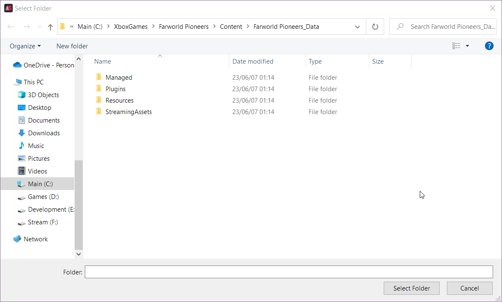
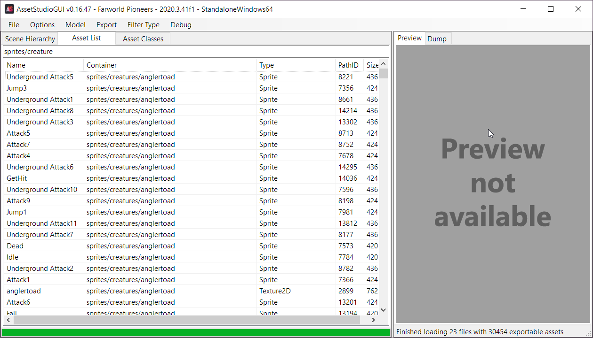
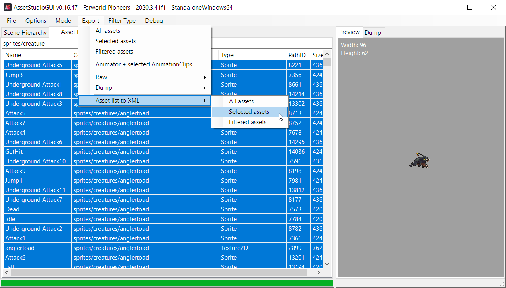
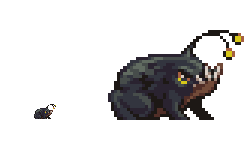
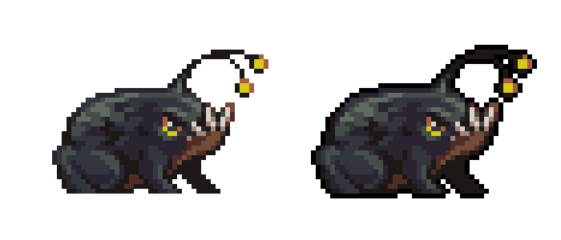
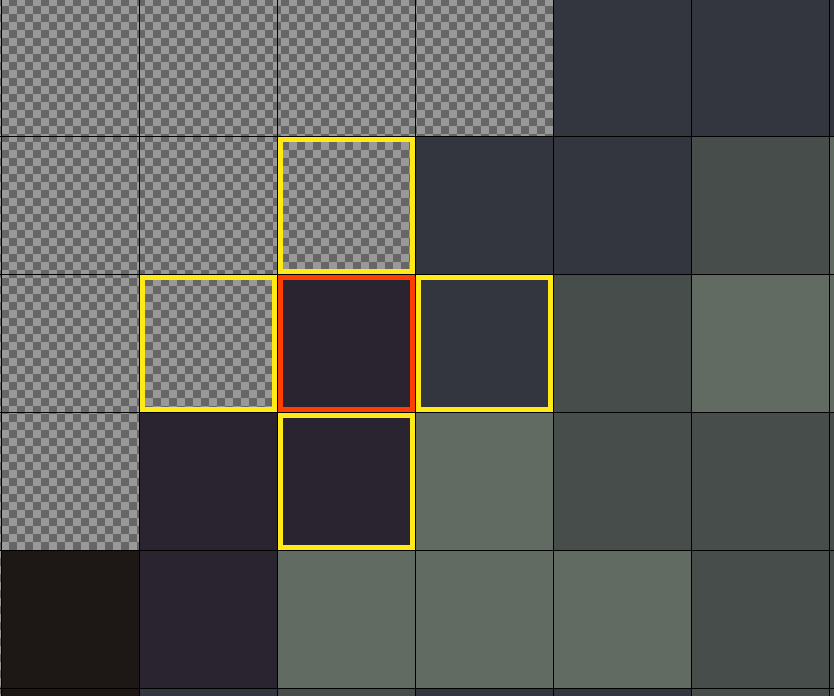
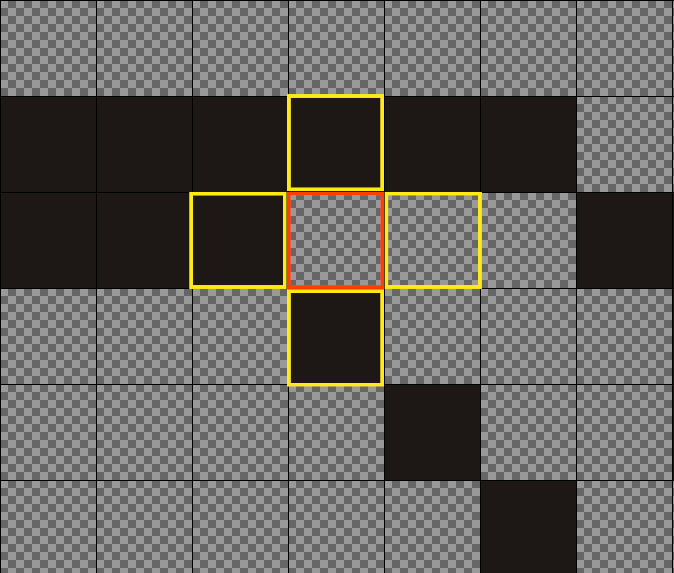

# Sprite Mag and Border

## What brought me here
I tried out [Farworld Pioneers Wiki on Wiki.gg](https://farworldpioneers.wiki.gg/wiki/Farworld_Pioneers_Wiki) and noticed that the wiki was missing a lot of creatures and none of them had their sprites uploaded. So I used AssetStudio to grab the sprites and found the [Image Formatting Guidelines](https://farworldpioneers.wiki.gg/wiki/Meta:_Image_Formatting).

Pretty simple: x6 upscaling, 6px top and bottom transparent padding, and a 6px border around the actual sprite with the sprite centered.

## What I wanted to achieve
Instead of just grabbing one sprite for each creature in the game and manually editing them, I grabbed all of them with intent to automate the Sprite Editing process and keep things nice and tidy.

The full process looks something like this:
1. Export Asset.xml file from AssetStudio
2. Process Asset.xml to get list of creatures
3. Create folders based off list of creatures
4. **Manually** extract Sprites into their designated folders created in Step 3
5. Remove all spaces from files, replacing them with an `_`
6. x6 Upscale, Crop, Center, and create Padding for Sprite, saved as `*_x6_borderless.png`
7. Add 6x6 black border around sprite, saved as `*_x6_bordered.png`
8. Move all `*_x6_bordered.png` images to a `x6` folder, separated into their indvidual creature folders
9. Browse through the results with pride and eventually upload them

All steps have already been completed and my task is already done.

I want to tackle the extraction process of the sprites at some point, but that's bonus content relative to the task at hand.

## What I want to achieve now

 Now I'm pushing the resulting code to GitHub so I can start refactoring it to be more useful outside of this one particular solution as well as show how I solved the problem now and how the problem will be solved when I'm done.

 The steps above will all remain the same, but how we achieve them will change significantly.
 
 There's a lot that can be done, and some that I already did before uploading, here's a likely not complete list:

 * Separate code into a multi-file solution (I already started doing this by the initial commit)
 * Separate certain steps, `add_border_to_all_images()` has major side effects that need to be separated for example
 * Make things more dynamic, the export to an `x6` directory is hardcoded and so is the scaling itself, we can fix that
 * Refactor the interfacing between the actual image and the magnified pixel object

 ## The Full Process (In Depth)

### Export Asset.xml file from AssetStudio

[AssetStudio](https://github.com/Perfare/AssetStudio) is no longer being worked on, but it does still work.

I load in the entire contents of the Pioneers Folder, though you really only need the Resources.Assets file.



If you go to the Asset List tab and add `sprites/creatures` to the filter, you'll find all the creatures listed.



You could sort by Type and not select the Texture2D items, but I chose everything. Now we just extract, simple enough.



### Process Asset.xml to get list of creatures

I looked up how to deal with XML files, assuming it was going to be easy.

Then I found a few articles that talked about how complicated it was going to be.

Turns out, it really depends. For what I'm doing, we can go the DOM route.

```
from xml.dom.minidom import parse

# Getting List of Assets from AssetStudio XML Export
def get_assets():
    document = parse("assets.xml")
    assets = document.getElementsByTagName("Asset")
    return assets
```
Then we take the returned elements from `get_assets()` and consolidate each file by creature.

```
# Extracting Creatures from Asset List
def load_creatures():
    creatures_dict = {}

    assets = get_assets()

    for a in assets:
        container_path = a.getElementsByTagName("Container")[0].firstChild.nodeValue.split("/")
        creature = container_path[len(container_path)-1]
        
        if creature not in creatures_dict and creature.find("_glow") == -1:
            creatures_dict[creature] = []

        if creature.find("_glow") == -1:
            creatures_dict[creature].append(a.getElementsByTagName("Name")[0].firstChild.nodeValue.replace(" ", "_"))

    return creatures_dict
```

### Create folders based off list of creatures

Folder creation is simple, using the `os` Python package and iterating through the list created earlier to create the directory structure.

```
def create_folders(src_list, target_dir):
    target_directory = os.path.join(parent_directory, target_dir)

    print(target_directory)

    if not os.path.exists(target_directory):
        os.mkdir(target_directory)

    for item in src_list:
        new_directory = os.path.join(target_directory, item)
        if not os.path.exists(new_directory):
            print('Creating directory for {}'.format(item))
            os.mkdir(new_directory)
        else:
            print('Directory for {} already exists'.format(item))
    
    return target_directory
```

Things like `os.path.join(parent_directory, target_dir)` need to be rewritten to have the path joining be done on the function call and not in the function itself to allow for more explicit control of input and output pathing.

### **Manually** extract Sprites into their designated folders created in Step 3

Here we go back to AssetStudio, now doing the actual extraction for each creature into the newly created folders.

There are roughly 66 creatures, and it took about 30 minutes the last time I did it.

Again, I would like to automate this, but it seems like there are a few handful of hours of work into trying to get the information out of the file by reading and working with the bytes of the file in the same way AssetStudio has.

For the purpose of getting the actual problem solved, I just ate the 30 minutes of manual work.

### Remove all spaces from files, replacing them with an `_`

Again, very simple using standard features found in the `os` package

```
def remove_spaces_from_files(target_dir):
    images_with_spaces_found = False
    for root, dirs, files in os.walk(target_dir):
        for name in files:
            if name.find(" ") != -1:
                images_with_spaces_found = True
                print(name)
                new_name = name.replace(" ", "_")
                os.rename(os.path.join(root, name), os.path.join(root, new_name))
    if not images_with_spaces_found:
        print("No files found with spaces")
```

### x6 Upscale, Crop, Center, and create Padding for Sprite, saved as `*_x6_borderless.png`



This was actually the easiest part of it all, we just outsourced all the work to [ImageMagick](https://imagemagick.org/index.php) and we're making an `os.system` call to execute the command.

The command of concern is `magick ORIGNAL_FILE -scale NEW_IMAGE_WIDTH -trim -alpha set -bordercolor none -border 6x12 NEW_IMAGE`.

`-scale` doesn't work how I thought it would where a `2` would mean twice as large. Instead it seems like whatever number I put in, that's going to be the width of the image. Our requirements say we need the image to be x6 as large, so we do `6*IMG_WIDTH` to get `NEW_IMAGE_WIDTH`.

`-trim` shrinks down the image to the size of the content, which is super useful because some sprites have a ton of space.

`-alpha set -bordercolor none -border 6x12` makes transparency a thing and sets the border color to be transparent while also creating a 6x12 border. We choose 6x12 because our requirements want a 6x6 border around the content with 6px of padding on the top and bottom of the image, so we add 6px to the left and right of the image and 12px to the top and bottom, making the **creature's border** sit snug on the left and right edges of the image.

```
def scale_and_trim_image(filep):
    new_image_path = filep.replace(".png", "_x6_borderless.png")

    if filep.find("borderless") >= 0:
        new_image_path = filep

    if os.path.exists(new_image_path):
        print('Borderless Already Exists: {}'.format(new_image_path))
        return new_image_path

    x1 = get_image_size(filep)["width"]
    x6 = x1*6

    print('Trimming {}'.format(filep))
    os.system('magick {} -scale {} -trim -alpha set -bordercolor none -border 6x12 {}'.format(filep, x6, new_image_path))
    return new_image_path
```

### Add 6x6 black border around sprite, saved as `*_x6_bordered.png`



For most of this, we've gone from point A to point B, but to explain this part of the journey, we're going to go through some twists and turns to show you something closest to my actual journey and not just the final path.

#### **The Magnified Pixel**

When we scaled the image we basically take each pixel and insert duplicates across the x and y axis multiple times. In our case we did x6 scaling, so 1px = 6px and 1px of movement on the original image is 6px of movement on the scaled image.

To help manage this, we have The Magified Pixel.

```
class MagnifiedPx:
    top_left_x6px = (0,0)
    bottom_right_x6px = (5,5)

    # Some Implementation Details Removed

    def move_right(self, amount = 1):
        self._move_x(amount)

    def move_left(self, amount = 1):
        self._move_x(-amount)

    def move_up(self, amount = 1):
        self._move_y(-amount)

    def move_down(self, amount = 1):
        self._move_y(amount)

    def get_move_right(self, amount = 1):
        return self._get_move_x(amount)

    def get_move_left(self, amount = 1):
        return self._get_move_x(-amount)

    def get_move_up(self, amount = 1):
        return self._get_move_y(-amount)

    def get_move_down(self, amount = 1):
        return self._get_move_y(amount)

    def set_location(self, x, y):
        self.top_left_x6px = (x,y)
        self.bottom_right_x6px = (self.top_left_x6px[0]+5,self.top_left_x6px[1]+5)

    def align_left(self):
        tl = self.top_left_x6px
        br = self.bottom_right_x6px
        self.top_left_x6px = (0, tl[1])
        self.bottom_right_x6px = (5, br[1])
    
    def get_cursor_pixel_list(self):
        l = []
        tl = self.top_left_x6px

        y = 0
        while (y < 6):
            x = 0
            while (x < 6):
                l.append((tl[0]+x,tl[1]+y))
                x += 1
            y += 1
        return l

    def cursor(self):
        return (self.top_left_x6px, self.bottom_right_x6px)
```

The MagPx holds onto the coordinates for the top-left and bottom-right pixels on the scaled image that act as the bounds for what a single pixel is on the original image. Meaning, the color value of pixel `(0,0)` on the original image should match with every pixel between `(0,0)` and `(5,5)` on the scaled image.

A lot of what was done with this class was with intent to go programmatically go through the scaled image, moving the MagPx around. This didn't actually happen how I planned. Instead, I mainly used this class to manual validate pixel values.

#### **Using Math to Create a Border**

Originally, the magpx would move and then check to see if there are any transparent pixels around it to sum a score for the target pixel.



If a pixel has color, you add 1, if it doesn't, you add 0. The minimum score is 0 and the max is 5, with the image above resulting in a score of 3 for the pixel with a red border. The left neighboring pixel, if calculated, would result in a score of 2.

There are problems with this method though, because just going off of score doesn't tell us anything. The image below shows us a similar score of 3, yet the pixel will need a border while the example prior would not.



To combat this, we simply keep track of whether or not the pixel being scored is itself transparent. This makes the logic super simple: If it has a score > 0 AND it's transparent, it needs a border.

Bare in mind, we've been talking about this problem as if we are doing this on a pixel by pixel basis, but we're actually doing this on a 6x6px basis. There's a few ways we could do this, but I'll talk about three:

1. Top-Left Pixel Full Trust: Only looking at the top-left pixel of the MagPix for the value
2. Quick Scan: Look at Top-Left and Bottom-Right for matching values, assuming everything in between matches
3. Full Scan: Look at every between the Top-Left and Bottom-Right to ensure the correct value throughout

I chose option 2, because I already validated that scaling was happening cleanly and we are working with pixel based sprites and not an actual image, so there shouldn't be inconsistency in the individual pixel values in the first place.

#### Using the scores to figure out what pixels need edited to make a border

The steps here are relatively straightforward:

1. Get a list of all MagPx cursor positions (i.e. a list of all the original image pixels)
2. Get a score for each item on the list
3. Filter out items ("pixels") that are not transparent or have a 0 for a score
4. Return the resulting list

```
def get_border_list(si):
    x6p_cursor_list = get_cursor_list(si.width, si.height)
    all_x6px_border_scores = get_border_scores(si, x6p_cursor_list)

    def transparent_and_gt0(target_px):
        if all_x6px_border_scores[target_px]['is_transparent'] and all_x6px_border_scores[target_px]['transparency_score']:
            return True
        return False

    return filter(transparent_and_gt0, all_x6px_border_scores)
```

Getting the cursor list is easy, but could probably be calculated with a little math

```
def get_cursor_list(width, height):
    x6p = x6px()
    x6p_count_x = width/6
    x6p_count_y = height/6

    r = []

    y = 0
    x = 0
    while(y < x6p_count_y):
        r.append(x6p.cursor())
        x = 1
        while(x < x6p_count_x):
            x6p.move_right()
            r.append(x6p.cursor())
            x += 1
        x6p.move_down()
        x6p.align_left()
        y += 1

    return r
```
Getting the score requires a little bit of work to make sure we aren't looking at non-existing pixels

```
def get_border_scores(si, x6p_list):
    def calculate_neighbor_transparencies(cursor, si):
        tl, br = cursor
        tlx, tly = tl
        brx, bry = br
        
        ref_x6px = x6px()
        ref_x6px.set_location(tlx, tly)

        nesw = [
            ref_x6px.get_move_up(),
            ref_x6px.get_move_right(),
            ref_x6px.get_move_down(),
            ref_x6px.get_move_left()
        ]

        valid_nesw = {}

        for neighbor in nesw:
            if is_valid_position(neighbor, si.width, si.height):
                if cursor_transparency_quick_scan(neighbor, si):
                    valid_nesw[neighbor[0]] = 0
                else:
                    valid_nesw[neighbor[0]] = 1
        
        return valid_nesw
    
    border_scores = {}

    for cursor in x6p_list:
        tl, br = cursor
        tlx, tly = tl
        brx, bry = br

        current_x6px_transparency_score = 0
        current_x6p_is_transparent = True

        # Get Current x6pixel transparency score
        if not cursor_transparency_quick_scan(cursor, si):
            current_x6px_transparency_score += 1
            current_x6p_is_transparent = False

        # Check if NWSE are transparent
        neighbor_values_to_add = calculate_neighbor_transparencies(cursor, si)

        # Add 0 if not transparent, 1 if it is
        for neighbor in neighbor_values_to_add:
            current_x6px_transparency_score += neighbor_values_to_add[neighbor]
        
        border_scores[tl] = {
            "transparency_score": current_x6px_transparency_score,
            "is_transparent": current_x6p_is_transparent
        }
    
    return border_scores
```

And finally, we can go through each of the remaining items and start filling in pixels with Black (`(0,0,0,255)`).

```
def add_border_to_image(img_path):
    new_image_path = scale_and_trim_image(img_path)
    bordered_image_path = new_image_path.replace("_x6_borderless.png", "_x6_bordered.png")
    
    if os.path.exists(bordered_image_path):
        print('Bordered Already Exists: {}'.format(bordered_image_path))
        return bordered_image_path
    
    si = SpriteImage(new_image_path)
    border_list = get_border_list(si)

    print('Adding border to {}'.format(new_image_path))
    for x6p in border_list:
        x, y = x6p
        yi = 0

        while yi < 6:
            xi = 0
            while xi < 6:
                si.img[x+xi,y+yi] = (0,0,0,255)
                xi += 1
            yi += 1

    si.save(bordered_image_path)
    return bordered_image_path
```

Because this whole process is meant to work together, the function shown returns the path to the newly created image. This setups us up for moving the files in a much more efficient manner than we originally were going to.

### Move all `*_x6_bordered.png` images to a `x6` folder, separated into their indvidual creature folders

Before we talk about how we moved the files (it's pretty simple), let's talk about how we iterated through all the files and added borders to them.

```
def add_border_to_all_images(src_directory, target_dir):
    bordered_images = []
    for root, dirs, files in os.walk(src_directory):
        for name in files:
            if "Texture2D" not in root:
                split_root = root.split("\\")
                creature = split_root[len(split_root)-2]

                if name.find("_x6_bordered") >= 0:
                    print("Image is already bordered")
                    bordered_images.append((os.path.join(root,name), creature))
                else:
                    bordered_image_path = add_border_to_image(os.path.join(root, name))
    
    return bordered_images
```

As you might expect, we took the original function (`add_border_to_image`) and wrapped it around another function (`add_border_to_all_images`) that will call it multiple times on different images.

To get those different images, we walked the entire directory that was created way back when we created folders for each creature.

When you exported to each creature folder, the image will export to `$Creature/Sprites/$Image`. If you were like me and too lazy to manually filter out the Texture2D results, you'll also have a `$Creature/Texture2D/*` directory. Thus, when we walk the directory using `os.walk`, we filter out the `Texture2D` results.

We also check to see if the image in question is already bordered, if so, we move onto the next image. Note that if the image is already bordered, that means we've already processed it but it still exists in the original folder. This means that eventually we will stumble across the original image and it will want to make another bordered image.

We handle this in `add_border_to_image()` which you can see up above. I could have created something more object oriented where we used that dict of creatures that contained a list of each filename that we created earlier, but my solution seemed more straightforward and effective for accomplishing what I needed.

I'll likely change it to be more object oriented later.

Back to movement.

Once we have the list of fully qualified file paths to the newly created bordered images, we go through each one and move them to the target directory, in this case it was `x6/$Creature/$Image`.

```
bordered_images = add_border_to_all_images(creatures_dir, target_dir)

    for bi in bordered_images:
        move_file(bi[0], target_dir, bi[1])
```

```
def move_file(target_file, target_dir, subfolder = None):
    destination_file = ""
    split_target = target_file.split("\\")
    f = split_target[len(split_target)-1]
    if subfolder:
        destination_folder = os.path.join(target_dir,subfolder)
        destination_file = os.path.join(target_dir,subfolder,f)
        if not os.path.exists(destination_folder):
            os.makedirs(destination_folder)
    else:
        destination_file = os.path.join(target_dir, f)

    print('Moving {} to {}'.format(f, destination_file))
    os.rename(target_file, destination_file)
```

### Browse through the results with pride and eventually upload them


